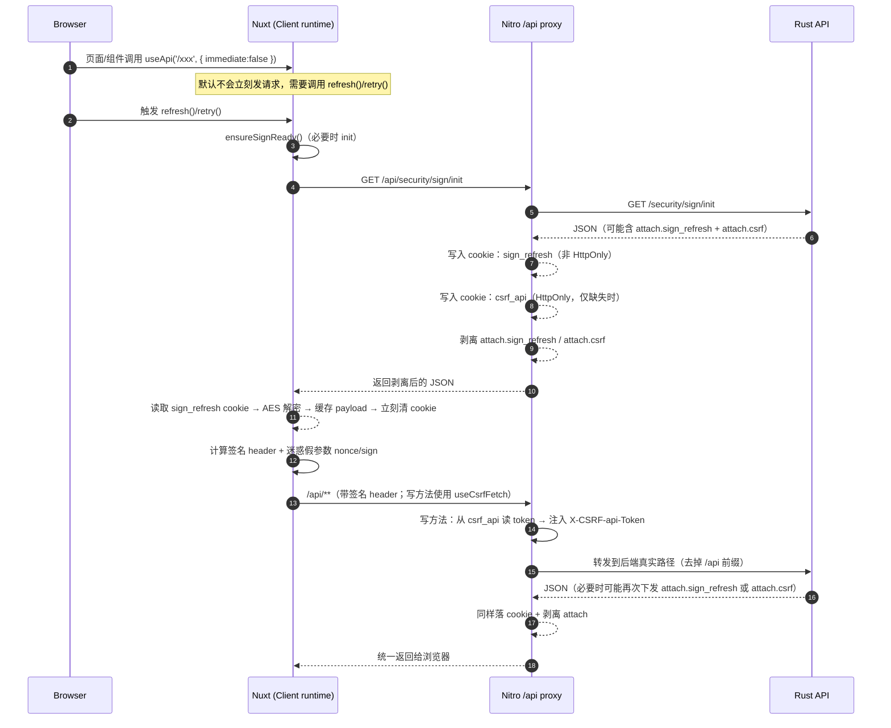

# 基本说明

- I:\Desktops\LofiTickDesktop
- I:\Backends\Rust\LofiTick.API
- I:\Frontends\LofiTick.Desktop.UI
- I:\Desktops\LofiTick.Desktop

这三个文件夹，我今后就称作 api nuxt 和 tauri 或者与之对应的了，我后面将给你提一些需求，你来帮助我实现。

# 基本说明

首先，我要实现的是一个url签名的功能，因为只要涉及到前端签名相关的东西，就得暴露给前端，所以100%隐藏是不可能的，我们要做的是提高门槛，让普通人无法轻易破解。而且就算被破解了，也只能合法访问到 api 的接口，就像普通网站做的那样的公开接口一样，就算废了九牛二虎之力破解了签名算法，也只能访问到公开接口，无法访问到其他接口。因为这是url签名，又不是登录用的jwt。

首先，我给你看下我的老的设计，I:\Desktops\LofiTick.Desktop，这个目录，老的设计是3个项目集成到一起的，主要是 nuxt4 实现的，我们现在拆分成了三个项目。

首先我的nuxt项目必须开启ssr的，因为今后可能网页也会用到这个接口和这个nuxt项目，所以必须开启ssr的，你看我老的设计的 I:\Desktops\LofiTickDesktop\frontend\app\composables\hooks\useApi\index.ts 这个文件，主要是用来请求接口的，自动做了很多安全方面的设计。而且非常兼容ssr。

因此新的项目，I:\Frontends\LofiTick.Desktop.UI\app\composables\hooks\useApi\index.ts 也必须完全支持ssr的，而且用的是 Nuxt5，别跟我说什么 Nuxt5 还没发布什么的，我知道，因为 https://nuxt.com/docs/5.x/getting-started/upgrade 这个文档已经发布了，所以我们完全可以用 Nuxt5 来开发了，不是说必须等待 Nuxt5 正式发布了才能开发，而是说我们现在就可以用 Nuxt5 来开发了，这样才能等到 Nuxt5 正式发布了，我们的项目也已经开发好了，甚至可能已经上线了。

# 逻辑说明

api 需要提供两个接口，一个是 init，另一个是 refresh；

## AES Key 的计算方法

- 设计一个 AES Key 的计算方法，这个 AES Key 是用来加密这些敏感数据的，前端js在生成签名的时候，需要用这个 AES Key 来解密签名字符串的；这样前端保留着这个算法，后端也有这个算法，这样解密的时候就比较安全了，至少不是明文的签名字符串了，而且生成的这个 key 在一段时间内，是一样的，过了这个时间就变了，因为如果每次都不一样，那前端就没法用了，解不开了，至于说的一段时间是这样的；
- 当然还有个问题，如果后端加密的时候，刚好一个key，到了前端计算出来的是另外一个，就是说刚好在过渡期生成的，怎么办？是不是应该也设计一个过渡期的窗口期，可以兼容老的key？过渡期过了，老的key就废了，前端也不需要兼容了，这样就比较合理了；

## init 接口

- 永远都得在 nuxt 的 server 端来调用；
- 这个接口主要是用来初始化签名的，前端在第一次访问的时候，页面还没有打开的时候，由 Nuxt 的 server 端来访问这个接口，获取到签名的相关信息，api 端口获取到后，会读取：I:\Backends\Rust\LofiTick.API\.env 文件中的以下字段，当然 rust 端已经有工具实现了读取：
  SECURITY_SIGN_MASTER_KEY
  SECURITY_SIGN_TTL_SEC
  SECURITY_SIGN_CLOCK_SKEW_MS
  SECURITY_SIGN_HEADER_NAME
  SECURITY_SIGN_HEADER_SIG_PREFIX
  SECURITY_CSRF_COOKIE_NAME
  SECURITY_CSRF_HEADER_NAME

## refresh 接口

同样是这个 AES Key 的计算方法，它主要包含了密钥相关的东西
SECURITY_SIGN_TTL_SEC
SECURITY_SIGN_CLOCK_SKEW_MS
SECURITY_SIGN_HEADER_NAME
SECURITY_SIGN_HEADER_SIG_PREFIX

> 前端解密说明：Nuxt 前端需要一个公开的 AES seed（对应后端 SECURITY_SIGN_AES_SEED），请通过 `NUXT_PUBLIC_SIGN_AES_SEED` 注入到 runtimeConfig.public（用于解密 `attach.sign_refresh` 写入 cookie 的 blob）。

## init/refresh 接口通用说明

- api 端口只验证 apptype，其他签名，csrf 相关的内容，都不需要，否则会导致死循环；
- 我列举的那些字段，只是示例，是告诉你有哪些内容，千万别照抄，你要设计一个非常合理的json结构来返回这些内容的，可以存在其他的字段；

## 签名密钥计算

你需要先做一个rust 的 server 服务，然后实现密钥计算，有以下特点：

- 计算签名密钥，至于计算方法，你可以自己设计一个算法，注意，我说的是密钥算法，不是签名，是签名的密钥算法，用来给前端js生成签名用的密钥字符串，它是有时间限制的；
- 第一次访问页面，就是用户在浏览器中输入地址打开服务器响应网页前，Nuxt Server 端，肯定得访问服务器的，因为 useApi 中，只要缺少签名相关的内容，无论请求什么接口，都得在 useApi 中先排队，等待获取到 init/refresh 接口的响应内容，拿到这些内容后，才会继续请求接口的，否则就算请求接口了，也无法通过验证。

### 什么是一段时间

SECURITY_SIGN_TTL_SEC=600
SECURITY_SIGN_CLOCK_SKEW_MS=30000

- 这个意思是说，生成的签名密钥的有效期是10分钟，也就是600秒，前端在生成签名的时候，如果当前时间和服务器时间相差超过了30秒（30000毫秒），所以一共是630秒的有效期，过了这个时间，前端就需要重新调用 refresh 接口来获取新的签名密钥了。
- 为什么是refresh接口呢？因为这个接口是用来刷新签名密钥的，init包含了很多固定死的设计，因此只需要获取一次就好了，后续只需要调用 refresh 接口来刷新签名密钥就好了。当然这两个接口，永远都得在 nuxt 的 server 端来调用，前端 js 是无法直接调用这两个接口的；

### 有哪些刷新方式和时机呢？

- 首先，分三种情况：

1. 用户第一次访问页面，页面还没有打开，这个时候，nuxt 的 server 端会访问 init 接口来获取这些内容的；
2. 当发起请求的时候，发现时效刚好过了 SECURITY_SIGN_TTL_SEC 秒，但还没有过 SECURITY_SIGN_TTL_SEC + SECURITY_SIGN_CLOCK_SKEW_MS 秒，服务器接收到了，发现快过期了但是还没完全过期，这个时候，请求的任何接口，都会被统一强制给json增加一个字段，里面包含了本应该刷新接口所提供的所有字段内容，当然也得是 AES Key 的加密方式；
3. 用户在页面打开后，过了一段时间，签名密钥过期了（SECURITY_SIGN_TTL_SEC + SECURITY_SIGN_CLOCK_SKEW_MS），这个时候，前端 js 就需要调用 refresh 接口来获取新的签名密钥了，刷完之后，才会请求接口的；

> 但是现在有个边界问题，我还不知道怎么办，如果前端请求的时候，符合 条件2 的情况，但是到了服务器再次验证条件所属的时候，发现变成了条件3了，这个时候，服务器应该怎么处理呢？我希望静默处理这些，但是如果是只要是过期 SECURITY_SIGN_TTL_SEC 秒了，无论什么时候都直接返回新的密钥，条件3的意义就没了。
> 我的想法是，当服务器端因为从 条件2 变成 条件3 的情况，我认为就得拒绝，然后前端发现拒绝后，直接进入条件3重试一次就行了吧？

### 那么前端怎么获取到这些需要的内容呢？

- 条件 1 或者 2，nuxt server 代理后接到 api 加密的数据，永远不会直接把加密的内容，直接返回给前端。它会先把内容原封不动的放到 cookie 里面，同时改写json，删除对应刷新的字段，再返回。然后前端 useApi 只要发现是 init 接口的响应，或者计算出来服务器快到期了（这是请求前计算到的结果，绝对不能是请求后计算的结果，因为状态条件可能不一样了），就会从 cookie 里面获取到这个加密的内容，然后用 AES Key 来解密这个内容，然后缓存起来，同时删除对应的 cookie；或者也可以无论什么情况，接收到回传的数据，先尝试读取cookie，只要读取到了，就解密，然后就会这个cookie值，保证万无一失。
- 条件 3，既然已经完全过期了，还是直接刷新呗，然后还是放到 cookie 里面，前端拿到响应后，直接从 cookie 里面获取到这个加密的内容，然后用 AES Key 来解密这个内容，然后缓存起来，同时删除对应的 cookie；然后拿着新的签名密钥，继续请求接口的；

#### api 端口的设计

GET /security/sign/init
GET /security/sign/refresh

#### csrf 相关的设计

- 我打算 api 和 nuxt 都要验证 csrf 的，因为他们两个，csrf 的实现和方案都不一样的，cookie会记录两个的，一个给 api 的，一个给 nuxt 的；

# 一定要注意

好好分析我给你的这四个项目目录：

- I:\Desktops\LofiTickDesktop
- I:\Backends\Rust\LofiTick.API
- I:\Frontends\LofiTick.Desktop.UI
- I:\Desktops\LofiTick.Desktop

这三个项目目录，分别是后端 api 项目，前端 nuxt 项目，和 tauri 项目，它们都是从旧的项目 I:\Desktops\LofiTickDesktop 中分离出来的，所以它们的设计和实现，因为我打算把api拆开，ui拆开，客户端拆开，这样方便扩展更灵活。

# 其他说明

- 我知道，前端没有100%的隐藏方案，我这个方案只是为了提高门槛，让普通人无法轻易破解。
- 即使被破解了，也只能合法访问到 api 的接口，就像普通网站做的那样的公开接口一样，就算废了九牛二虎之力破解了签名算法，也只能访问到公开接口，无法访问到其他接口。因为这是url签名，又不是登录用的jwt。
- 当然了，如果你有更好的设计方案，也可以提出来，我们一起讨论一下。总之，我的这个设计方案，是基于我对前端安全的理解和经验的，如果你有更好的设计方案，我也非常欢迎你提出来，我们一起讨论一下，看看哪个方案更合理，更安全，更易于实现。

---

# useApi 与 /api 代理：实现口径说明（必读）

> 本章不讲“应该怎么设计”，只讲“当前仓库就是这样实现的”。
> 目标：让你能从页面里调用 `useApi(...)` 开始，一路追到 Nitro `/api/**` 代理，再到 Rust API 的签名/CSRF 验证，任何一步都能对得上源码。

## 源码入口（以当前项目为准）

- 前端请求封装：`app/composables/hooks/useApi/index.ts`
- Nitro 通用代理：`server/api/[...path]/index.ts`
- Nuxt CSRF（nuxt-csurf）配置：`configs/nuxt/index.ts`（`security.csrf`）

## SSR 首屏规则（当前仓库强制口径）

- 当前仓库以 `configs/nuxt/index.ts` 的 `ssr: true` 为准，不允许把项目理解成纯客户端渲染。
- 只要页面“刚打开就应该看到数据”，该请求就必须作为 SSR 首屏请求处理：在页面或首屏必渲染组件的 `setup` 顶层使用 `await useApi(..., { immediate: true })`。
- 禁止把这类首屏数据请求降级成 `onMounted`、事件触发或其他仅客户端执行的补请求；否则 HTML 首屏会缺少真实数据。
- 对带签名、cookie、CSRF 的接口，`useApi` 与 `/api` 代理链路也必须兼容 SSR 首包，不能再走“先创建 `immediate:false`，再手动 `refresh()` 触发首包”的实现路径。

## 导航组件规则（当前仓库强制口径）

- 纯导航场景优先使用 `ULink`，或使用带 `to` / `href` 的链接型组件；不要把单纯的路由跳转、筛选跳转、外链跳转默认写成 `UButton + onClick + navigateTo`。
- 如果只是为了保持按钮外观，但行为本质仍是导航，允许继续使用带 `to` / `href` 的 `UButton`；关键是保留链接语义，而不是执着于组件名必须叫 `ULink`。
- 当 `ULink` 承接原本无下划线的文本按钮样式时，必须优先使用 `raw` 去掉 Nuxt UI 默认的底边装饰，再显式加 `no-underline`，最后按需要补 `hover:underline`；不要叠加组件默认底边线和自定义下划线。
- 排序、复制、开关、保存、打开弹窗、调用桌面能力等动作型交互，仍然按按钮处理，不要误建模成链接。

## 角色与链路（从浏览器到后端）

### Client（浏览器）发起普通 API 请求



### SSR（服务端渲染）期间的签名 bootstrap

SSR 阶段 `useApi` 的 bootstrap（`/security/sign/init` / `/security/sign/refresh`）不会走 `/api/**` 代理，而是直接请求后端 `apiBase`：

- 原因：SSR 场景下如果依赖“本次响应写入的 cookie”再读回来，会出现时序不可靠；直接从响应 JSON 里读 `attach.sign_refresh` 更稳定。
- 代价：SSR 直连后端时，后端下发的 CSRF token（`attach.csrf`）必须由 SSR 这次响应主动 set-cookie 到 Nuxt 域名下；否则后续同源 `/api/**` 代理在写方法里读不到 token。

## /api/\*\* 代理的真实行为（Nitro）

代理文件：`server/api/[...path]/index.ts`。

### 1）路径映射

- 浏览器只请求同源：`/api/**`
- Nitro 代理会把 `/api` 前缀去掉，拼到运行时配置的 `apiBase` 上：
  - `apiBase` 来自 `runtimeConfig.public.apiBase`（环境变量 `NUXT_PUBLIC_API_BASE`）
  - `/api/foo/bar` → `${apiBase}/foo/bar`

### 2）写方法自动注入后端 CSRF header

- 代理维护“后端 CSRF”兜底名称：
  - Cookie：`csrf_api`
  - Header：`X-CSRF-api-Token`
- 对 `POST/PUT/PATCH/DELETE`：
  - 代理从请求 cookie 里读取 `csrf_api`
  - 如果存在就注入上游 header：`X-CSRF-api-Token: <token>`

> 注意：这是“后端 CSRF”体系，不是 Nuxt 自己的 `nuxt-csurf`。

### 3）假参数（nonce/sign）校验（代理层可开关）

- 代理支持一个开关：`runtimeConfig.signFakeParamsValidate`（环境变量 `NUXT_SIGN_FAKE_PARAMS_VALIDATE`）
- 开启后：除了 `/security/sign/init` 与 `/security/sign/refresh`，其余请求会在代理层解析 query + JSON body，并强制校验：
  - `nonce` 必须存在且长度固定（8）
  - `sign` 必须存在且长度固定（24）

该校验只是一道“提前拦截”，Rust API 侧仍会执行强制校验；代理层开关只是为了更早失败、减少上游压力。

### 4）签名 refresh blob 的落盘与剥离

后端可能在响应 JSON 的 `attach.sign_refresh` 下发一个刷新 blob，格式以 `v1.` 开头。

代理逻辑：

1. 如果发现 `attach.sign_refresh` 且以 `v1.` 开头：
   - 将其写入 cookie（默认名 `sign_refresh`，但支持“提示名”与“响应 datas 指定名”）
   - 写入 cookie 时：**非 HttpOnly**（因为浏览器侧需要读取并解密）
2. 从响应 JSON 中删除 `attach.sign_refresh`，再返回给浏览器

cookie 名称选择顺序：

1. 请求头提示：`X-Sign-Blob-Cookie-Name`
2. 响应 `datas.sign_blob_cookie_name`
3. 兜底 `sign_refresh`

### 5）后端 CSRF attach 的落盘与剥离

后端在 `/security/sign/init` 这类接口中可能下发 `attach.csrf`：

```json
{
  "attach": {
    "csrf": {
      "token": "...",
      "cookie_name": "csrf_api",
      "header_name": "X-CSRF-api-Token"
    }
  }
}
```

代理逻辑：

- 若存在 `attach.csrf.token`：
  - 将 token 写入 Nuxt 域名下的 HttpOnly cookie（cookie 名称优先用 attach 的 `cookie_name`，否则兜底 `csrf_api`）
  - **仅在 cookie 缺失时才写入**（避免频繁覆盖）
- 然后剥离：
  - `attach.csrf`
  - `datas.csrf_cookie_name`
  - `datas.csrf_header_name`

目的：浏览器永远拿不到后端 CSRF token，只能通过同源 `/api/**` 代理在服务端注入 header。

## useApi 的真实行为（前端）

实现文件：`app/composables/hooks/useApi/index.ts`。

### 1）你在页面里到底应该怎么用

当前封装默认是 `immediate: false`：

- `useApi(...)` 只会创建请求实例，不会立刻发请求
- 需要你显式调用：
  - `refresh()`（最常用）
  - 或 `retry()`（不改动本次的 query/body/datas，仅重试）
  - 或它们的 `Debounced/Throttled` 版本

> 这也解释了：为什么“条件3自愈（refresh/init 后重试一次）”必须在 `refresh()/retry()` 里面做，而不能在初始化时做。

### 2）路径处理：/api 前缀与后端验签看到的 path

useApi 会做两次“路径口径”处理：

1. `toApiPath(path)`：确保浏览器侧请求一定是 `/api/**`
2. `toBackendPath(path)`：用于推导后端路径（去掉 `/api` 前缀）

签名计算用的 path 还有一个关键映射：`toBackendPathForSignature(backendPath)`。

- 它会对 `/desktop`、`/crons`、`/live` 这三类前缀做“剥离”
- 目的：对齐后端 `SecurityLayer` 在 `nest(prefix, router.route_layer(SecurityLayer))` 场景下读取到的 `uri.path()`
- 否则会出现：浏览器签的是 `/desktop/xxx`，后端验的是 `/xxx`，最终 `SIGN_MISMATCH`

### 3）签名状态（payload）来自哪里

useApi 维护一个全局状态：`useState('use-api-sign-state')`：

- `signBlobCookieName`：refresh blob 的 cookie 名（可被 init/refresh 返回的 datas 覆盖）
- `payload`：解密后的签名 payload（包含 `signHeaderName/signSigPrefix/signKeyHex/ttlSec/clockSkewMs/...`）

payload 的来源有两条路径：

#### Client：通过 cookie 中转

1. 先 `GET /api/security/sign/init`
2. Nitro 代理将 `attach.sign_refresh` 写入 cookie
3. useApi `consumeRefreshCookieIfPresent()` 读取 cookie：
   - 先读 `useCookie()` ref
   - 同 tick 兜底读 `document.cookie`（避免 `Set-Cookie` 写入后 ref 未同步）
4. 用 `NUXT_PUBLIC_SIGN_AES_SEED` 解密 refresh blob，写入 `signState.payload`
5. 立刻清掉该 cookie（避免重复使用）

#### SSR：直连后端，直接读 attach

SSR 调 `fetchSignBootstrap()` 时会直接请求 `${apiBase}${backendPath}` 并读取：

- `attach.sign_refresh`：直接解密成 payload（无需依赖 cookie）
- `attach.csrf`：由 SSR 显式 set-cookie 到 Nuxt 域名（因为 SSR 不经过 `/api` 代理）

### 4）迷惑假参数 nonce/sign

每次真正发起“需要签名”的请求前，useApi 会生成两个随机 hex 字符串：

- `nonce`：长度 8
- `sign`：长度 24

它们会随请求携带（GET 系列放 query；写方法放 body），并且会被代理层（可开关）与后端强制校验“存在且长度正确”。

重要：`nonce/sign` **不参与真实签名计算**，它们的作用是提高逆向门槛与拦截明显的伪造请求。

### 5）真实签名计算口径（canonical params）

签名计算发生在 `runWithSignature()` 里，关键步骤：

1. 取本次请求的最终参数来源并合并：
   - path 自带的 query（例如 `/quotes?page=1`）
   - `options.query`
   - 如果是写方法：还会合并最终 body（body + datas）
   - 额外强制加入 `ts`（毫秒时间戳字符串）
2. 将所有参数写入 canonical 表：
   - key 先做归一化（`a_b`/`a-b` → `aB`）
   - 丢弃 `nonce`/`sign`
   - 丢弃无法归一为稳定字符串的值
3. 对 key 做字典序排序
4. 生成 `key=value` 对（value 使用 `encodeURIComponent`）
5. 构造签名内容：

```
<signature_backend_path>?<sorted_param_pairs_joined_by_&>
```

6. 对内容做 `SHA-256` 得到 hex 小写
7. 用 payload 的 `signKeyHex` 做 HMAC-SHA256（注意：当前实现是把 `signKeyHex` 当作普通字符串字节，不做 hex decode）
8. 输出标准 Base64，拼到请求 header：

```
<payload.signHeaderName>: <payload.signSigPrefix><base64>
```

### 6）写方法为什么用 useCsrfFetch

写方法（非 GET/HEAD/OPTIONS）会优先使用 `useCsrfFetch`（来自 `nuxt-csurf`），否则回退到 `useFetch`。

这解决的是“浏览器 → Nitro”这一跳的 CSRF（Nuxt 自身防护），和“后端 CSRF”是两套东西：

- Nuxt CSRF（nuxt-csurf）：由 `configs/nuxt/index.ts` 的 `security.csrf` 控制
- 后端 CSRF：由 Nitro 代理从 HttpOnly `csrf_api` 读出，并注入上游 `X-CSRF-api-Token`

### 7）失败后的自愈重试（只重试一次）

useApi 会在 `onResponseError` 中读取响应体的统一 `status`，用于判断是否触发自愈：

- 安全模块（biz=800）且 aim=6（SIGN_TS_EXPIRED）或 aim=10（SIGN_MISMATCH）
  - 执行 `/security/sign/refresh`，更新 payload
- 安全模块（biz=800）且 aim=60/61/62（CSRF 缺失/缺 header/不匹配）
  - 执行 `/security/sign/init`，让代理补齐后端 CSRF cookie

之后流程固定：

1. 消费 refresh cookie（如果代理层下发了）
2. 重新计算本次请求签名 header
3. 强制更换 `useFetch` 的 key（避免缓存复用旧请求）
4. `base.refresh(...)` 再发一次

> 由于默认 `immediate: false`，该自愈逻辑只会在你调用 `refresh()` / `retry()` 时执行。

首个命中上述自愈条件的失败会保持静默，不会立刻发 API 错误 toast。

- 如果自愈后的第二次请求成功：整个过程不提示用户
- 如果自愈后的第二次请求仍失败：以第二次请求的最终结果为准再发 toast

这样可以避免“网页首次打开 / Tauri 首次启动时，签名或 CSRF 已过期但系统马上自愈成功，界面仍先弹一次错误”的误提示。

## 常见踩坑（按真实经历）

### 1）403 但以为是 SIGN_MISMATCH

如果后端先判定 `SIGN_TS_EXPIRED`（aim=6），签名对账逻辑不会触发，看起来就像“怎么改都不对”。

排查优先级建议：

1. 先看 `status.biz/status.aim`
2. 若 aim=6：优先检查机器时间/时区/NTP 对时（时钟漂移会让一切对账都无意义）
3. 若 aim=10：再查 path 剥离规则（`/desktop` 等）与参数归一化/排序/encode 口径

### 2）Client 场景下 cookie 读不到导致 payload missing

浏览器收到 `Set-Cookie` 后，同一个 tick 内 `useCookie()` ref 不一定同步。

当前实现已经兜底：`consumeRefreshCookieIfPresent()` 会额外从 `document.cookie` 读一次。

---

> 这章如果你希望我再补“最小可运行示例（首页一个 GET + 一个 POST）”，我可以继续按你现有 `useApi` 的 `immediate:false` 约定写一段示例代码与注意事项。

## useApi 限流口径（设置页必读）

`useApi` 返回值自带以下限流函数：

- `refreshDebounced`
- `retryDebounced`
- `refreshThrottled`
- `retryThrottled`

对应配置入口是 `rateLimit`：

```ts
const { refreshDebounced } = await useApi('desktop/settings/connections', {
  method: 'PATCH',
  immediate: false,
  rateLimit: {
    debounce: {
      wait: 300,
      leading: false,
      trailing: true
    }
  }
});
```

设置页口径统一如下：

- 只要是“同步 Redis / 远端设置”的 HTTP 写请求，优先使用 `useApi` 自带的 `rateLimit + refreshDebounced`，不要再在页面层额外包一层 `useDebounceFn` 去防抖同一条 HTTP 写链路。
- 如果同一个页面同时还要写本地 Tauri settings、窗口状态或其他非 HTTP 本地镜像，这类“非 useApi 请求”可以继续使用独立的页面层防抖；本地镜像与 Redis 同步分开处理即可。
- 查询列表、搜索建议、筛选联动等读请求，继续按现有模式使用 `refreshDebounced` / `refreshThrottled` 即可。

换句话说：防抖的归属应当和副作用归属一致。HTTP 请求由 `useApi` 自己限流，本地副作用由本地逻辑自己限流，避免同一条远端写链路被页面层和请求层重复防抖。
